# Fily Agentic Process - Complete Flow Diagram

## Complete Agentic Taxonomy Generation Process

```mermaid
graph TB
  Start([User Triggers Organize]) --> GetFiles[Get FileRecords from DB]
  GetFiles --> BuildCards["Build FileCards
  with summaries + tags
  (from SummaryTagAgent)"]

  BuildCards --> Strategy{File Count?}

  Strategy -->|< 600| SingleMode["Single Mode
  Depth: 1
  maxTags: 30
  samplesPerTag: 15"]
  Strategy -->|600-1800| Hierarchical1["Hierarchical Mode
  Depth: 2
  Roots: 6
  maxTags: 50
  samplesPerTag: 20
  Min Sub: 25"]
  Strategy -->|1800-4000| Hierarchical2["Hierarchical Mode
  Depth: 3
  Roots: 8
  maxTags: 60
  samplesPerTag: 25
  Min Sub: 20
  Min 3rd: 80"]
  Strategy -->|4000+| Hierarchical3["Hierarchical Mode
  Depth: 3
  Roots: 12
  maxTags: 80
  samplesPerTag: 20
  Min Sub: 15
  Min 3rd: 60"]

  SingleMode --> BuildOverview1["Build TaxonomyOverview
  Aggregate stats:
  - Extensions
  - Years
  - Tags
  - Path patterns"]
  Hierarchical1 --> BuildOverview2[Build TaxonomyOverview]
  Hierarchical2 --> BuildOverview3[Build TaxonomyOverview]
  Hierarchical3 --> BuildOverview4[Build TaxonomyOverview]

  BuildOverview1 --> SinglePlan["TaxonomyAgent.generatePlan
  Single-Pass Full Taxonomy
  via WorkerPool"]
  BuildOverview2 --> HierarchicalFlow[Start Hierarchical Flow]
  BuildOverview3 --> HierarchicalFlow
  BuildOverview4 --> HierarchicalFlow

  SinglePlan --> Repair1["repairPlan
  - Normalize folder paths
  - Fix Rule→Folder refs
  - Case-insensitive matching
  - Ensure /Other exists"]

  HierarchicalFlow --> TopLevel["TaxonomyAgent.generateTopLevelPlan
  Generate Root Folders Only
  via WorkerPool"]
  TopLevel --> AssignTop["getFileAssignments
  Assign Files to Root Folders
  using rule matching"]
  AssignTop --> CollectSubTasks[Collect Subfolder Tasks]

  CollectSubTasks --> LoopRoot{For Each Root Folder}
  LoopRoot --> CheckFiles["Has Enough Files?
  >= minFilesForSubLevel"]
  CheckFiles -->|No| SkipSub[Skip - Keep as Leaf Folder]
  CheckFiles -->|Yes| BuildSubOverview["Build Sub-Overview
  Only Files in This Root"]
  BuildSubOverview --> CreateSubTask["Create Subfolder Task
  TaxonomyAgent.generateSubLevelPlan
  via WorkerPool"]
  
  CreateSubTask --> AddToBatch[Add to Parallel Batch]
  SkipSub --> CheckDepth{Max Depth = 3?}
  AddToBatch --> CheckDepth

  CheckDepth -->|No| WaitSubTasks[Wait for All Subfolder Tasks
  Promise.all via WorkerPool]
  CheckDepth -->|Yes| CollectThirdTasks[Collect Third-Level Tasks]

  CollectThirdTasks --> CheckThird["Leaf Has Enough?
  >= minFilesForThirdLevel"]
  CheckThird -->|No| WaitSubTasks
  CheckThird -->|Yes| BuildThirdOverview[Build Third-Level Overview]
  BuildThirdOverview --> CreateThirdTask["Create Third-Level Task
  TaxonomyAgent.generateSubLevelPlan
  via WorkerPool"]
  CreateThirdTask --> AddToThirdBatch[Add to Parallel Batch]
  AddToThirdBatch --> WaitSubTasks

  WaitSubTasks --> ProcessSubResults["Process All Subfolder Results
  - Prefix IDs: root-id--child-id
  - Remove root rules
  - Merge sub rules/folders"]
  ProcessSubResults --> Repair2[repairPlan]

  Repair1 --> ValidateAgent{"ValidationAgent
  Available?"}
  Repair2 --> ValidateAgent

  ValidateAgent -->|No| ValidateQuality["validatePlan
  Log Warnings:
  - Broad rules (>50%)
  - Coverage issues"]
  ValidateAgent -->|Yes| RunValidation["ValidationAgent.validatePlan
  Check for Issues:
  - Generic folder names
  - Broken references
  - Too flat/deep structure
  - Vague names
  via WorkerPool"]

  RunValidation --> HasIssues{Issues Found?}
  HasIssues -->|No| ValidateQuality
  HasIssues -->|Yes| ApplyCorrections["ValidationAgent.applyCorrections
  Replace Faulty Folders/Rules
  with corrected versions"]
  ApplyCorrections --> RepairAgain["repairPlan Again
  Fix New Issues from Corrections"]
  RepairAgain --> ValidateQuality

  ValidateQuality --> ApplyPlan["applyPlanToFiles
  For each FileCard:
  1) findBestRule
  2) calculateRuleSpecificity
  3) normalizeConfidence
  4) calculateEnhancedConfidence
  5) Generate PlannerOutput"]

  ApplyPlan --> CheckOptimize{"OptimizerAgent
  Available?
  skipOptimization?"}
  CheckOptimize -->|No| End([Return PlannerOutput list])
  CheckOptimize -->|Yes| CollectLowConf["Collect Files:
  - Confidence < OPTIMIZER_CONFIDENCE_THRESHOLD
    (default: 50%)
  - Flagged by Validator"]
  
  CollectLowConf --> HasLowConf{"Any Files to
  Optimize?"}
  HasLowConf -->|No| End
  HasLowConf -->|Yes| BatchOptimize["OptimizerAgent.optimizePlacements
  Batch Size: OPTIMIZER_BATCH_SIZE
  (default: 25 files)
  Process in Parallel via WorkerPool"]

  BatchOptimize --> OptimizeLLM["LLM Call per Batch
  Re-evaluate Placement:
  - Use existing folders OR
  - Create new folders
  Improve Confidence"]
  
  OptimizeLLM --> ExtractResults["Extract Results:
  - optimizations[]
  - newFolders[]"]
  
  ExtractResults --> AddNewFolders{"New Folders
  Created?"}
  AddNewFolders -->|Yes| MergeFolders["Add New Folders to Plan
  - Generate unique IDs
  - Filter duplicates
  - Normalize paths"]
  AddNewFolders -->|No| MergeOptimized
  MergeFolders --> MergeOptimized["Merge Optimized Results
  Back into Outputs
  Fix filename paths if needed"]
  
  MergeOptimized --> End

  style Start fill:#e1f5ff
  style End fill:#d4edda
  style SinglePlan fill:#fff3cd
  style TopLevel fill:#fff3cd
  style CreateSubTask fill:#fff3cd
  style CreateThirdTask fill:#fff3cd
  style RunValidation fill:#f8d7da
  style BatchOptimize fill:#d1ecf1
  style OptimizeLLM fill:#d1ecf1
  style WaitSubTasks fill:#e7f3ff
  style AddNewFolders fill:#d1ecf1
```



## Key Components

### **Agents**

- 🎯 **TaxonomyAgent**: Generates folder structures and rules
  - `generatePlan()` - Single-pass full taxonomy (via WorkerPool)
  - `generateTopLevelPlan()` - Root folders only (via WorkerPool)
  - `generateSubLevelPlan()` - Child folders under parent (via WorkerPool, parallelized)
  - All LLM calls use `executeApiCall()` with WorkerPool for concurrency control

- 🔍 **ValidationAgent**: Quality assurance
  - `validatePlan()` - Detects logical errors (via WorkerPool)
  - `applyCorrections()` - Replaces faulty folders/rules
  - Flags files needing optimization

- ⚡ **OptimizerAgent**: Fine-tunes placements and creates folders
  - `optimizePlacements()` - Batch processes files (via WorkerPool)
  - Can create new folders when files don't fit existing structure
  - Returns `{ optimizations: OptimizerResult[], newFolders: OptimizerNewFolder[] }`

### **Worker Pool**

- **Default Max Workers**: `WORKER_POOL_DEFAULT_MAX_WORKERS` (80)
- **Usage**: All LLM API calls go through WorkerPool for parallel processing
- **Parallel Operations**:
  - Subfolder generation (all root folders processed simultaneously)
  - Third-level generation (all eligible folders processed simultaneously)
  - Optimizer batches (multiple batches processed in parallel)
  - Validation (if multiple validation calls needed)

### **Strategy Thresholds** (from `constants.ts`)

- **< 600 files**: Single-pass, simple structure
- **600-1800 files**: 2-level hierarchical, 6 roots, min 25 files for sub-level
- **1800-4000 files**: 3-level hierarchical, 8 roots, min 20 files for sub-level, min 80 for 3rd level
- **4000+ files**: 3-level hierarchical, 12 roots, min 15 files for sub-level, min 60 for 3rd level

### **Repair & Validation Steps**

1. **repairPlan()**: 
   - Normalizes folder paths (ensure `/` prefix, no trailing `/`)
   - Fixes rule→folder references (case-insensitive matching)
   - Ensures `/Other` folder exists as fallback
   - Called after plan generation and after validation corrections

2. **ValidationAgent**: 
   - Detects logical errors (generic names, broken refs, structure issues)
   - Applies corrections to faulty parts
   - Flags files needing optimization

3. **repairPlan() again**: 
   - Fixes any new issues from validation corrections

4. **validatePlan()**: 
   - Logs warnings about plan quality (broad rules, coverage)

### **Optimization**

- **Confidence Threshold**: `OPTIMIZER_CONFIDENCE_THRESHOLD` (default: 0.5 / 50%)
- **Batch Size**: `OPTIMIZER_BATCH_SIZE` (default: 25 files)
- **Process**: 
  - Only optimizes files with confidence < threshold OR flagged by validator
  - Runs in parallel via WorkerPool
  - Can create new folders when files don't fit existing structure
  - New folders are automatically added to taxonomy plan

### **Constants** (from `packages/core/src/planner/constants.ts`)

All magic numbers are centralized in `constants.ts`:

- **Optimizer**: `OPTIMIZER_CONFIDENCE_THRESHOLD`, `OPTIMIZER_BATCH_SIZE`, `OPTIMIZER_MAX_SUMMARY_WORDS`
- **Confidence Calculation**: `MIN_BASE_CONFIDENCE`, `MAX_BASE_CONFIDENCE`, `BASE_CONFIDENCE_RANGE`, etc.
- **Agent Batch Sizes**: `SUMMARY_TAG_VISION_BATCH_SIZE`, `SUMMARY_TAG_TEXT_BATCH_SIZE`
- **API Settings**: `API_DEFAULT_TIMEOUT_MS`, `API_BATCH_TIMEOUT_MS`, `API_DEFAULT_MAX_TOKENS`
- **Worker Pool**: `WORKER_POOL_DEFAULT_MAX_WORKERS`, `WORKER_POOL_MAX_ITERATIONS`
- **Content Limits**: `SUMMARY_TAG_MAX_SUMMARY_LENGTH`, `SUMMARY_TAG_MIN_TAGS`, `SUMMARY_TAG_MAX_TAGS`

## Data Flow Summary

```
FileRecord[] 
  → FileCard[] (with summaries + tags from SummaryTagAgent)
  → TaxonomyOverview (aggregate stats: extensions, years, tags, path patterns)
  → TaxonomyPlan (folders + rules)
    → repairPlan() (fix references)
    → ValidationAgent (validate & correct)
    → repairPlan() again (fix new issues)
  → PlannerOutput[] (file_id, virtual_path, tags, confidence, reason)
    → OptimizerAgent (optimize low-confidence files, create new folders if needed)
  → Final PlannerOutput[]
```

## Code Organization Guide

This flow diagram serves as a blueprint for code organization:

### **Core Planner Module** (`packages/core/src/planner/`)
- `taxonomy-planner.ts` - Main orchestrator (steps 1-8)
- `taxonomy-orchestrator.ts` - Hierarchical plan generation (parallel subfolder processing)
- `taxonomy-strategy.ts` - Strategy selection based on file count
- `taxonomy-overview.ts` - Overview building (aggregate stats)
- `taxonomy-rule-matcher.ts` - Rule matching logic (findBestRule, calculateRuleSpecificity)
- `taxonomy-types.ts` - Type definitions (TaxonomyPlan, VirtualFolderSpec, PlacementRule)
- `constants.ts` - All configuration constants

### **Agent Module** (`packages/core/src/agents/`)
- `taxonomy-agent.ts` - LLM calls for taxonomy generation (via WorkerPool)
- `validation-agent.ts` - Plan validation and correction (via WorkerPool)
- `optimizer-agent.ts` - File placement optimization and folder creation (via WorkerPool)
- `summary-tag-agent.ts` - Content extraction and tagging (large file - candidate for splitting)
- `worker-pool.ts` - Concurrency management for all LLM calls
- `api-call-helper.ts` - Unified API call execution with timeout/error handling
- `llm-client.ts` - LLM provider abstraction (OpenRouter/OpenAI)

### **Prompts Module** (`packages/core/src/agents/prompts/`)
- `taxonomy-agent-prompt.ts` - Single-pass taxonomy prompt
- `taxonomy-hierarchical-prompt.ts` - Top-level and sub-level prompts
- `validation-agent-prompt.ts` - Validation prompt
- `optimizer-agent-prompt.ts` - Optimizer prompt (includes new folder creation)
- `summary-tag-agent-prompt.ts` - Summary and tag generation prompt

## Current Implementation Status

✅ **Implemented:**
- Parallel subfolder generation via WorkerPool
- Optimizer can create new folders
- All constants centralized
- Worker pool used throughout for concurrency
- Repair logic for fixing LLM output issues
- Validation with corrections
- Confidence threshold: 50% (configurable)

📋 **Future Improvements:**
- Split large files (e.g., `summary-tag-agent.ts`) into smaller modules
- Add more granular progress reporting
- Iterative validation (multiple passes)
- More sophisticated folder creation rules
